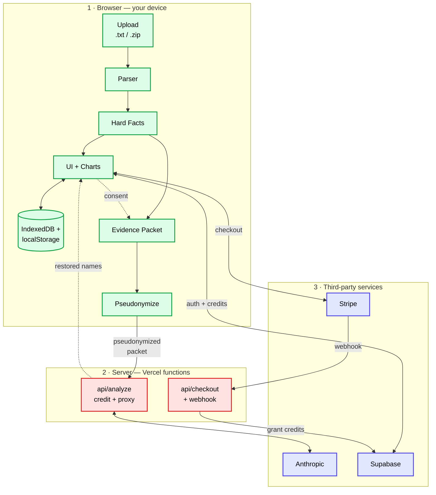

# tea — Concept & Architecture

> **TL;DR.** tea is a single-page React app that reads a WhatsApp chat export and returns statistics plus AI-written profiles about the people in the chat. The full chat never leaves the browser. Only a curated, pseudonymized evidence packet is sent to the AI. Default mode runs on pre-written fixtures, so the entire UX works offline without any API key.

**Who this document is for.** Engineers who plan to read, modify or contribute to the codebase and reviewers trying to evaluate the design. It assumes you know TypeScript, React and what a serverless function is. It does *not* assume you know anything about WhatsApp exports, the Anthropic API, Stripe Checkout or Supabase.


**What you'll know after reading this.**
1. The three layers the code is split across and why.
2. How a chat travels from upload to rendered analysis.
3. Where to look in the codebase when something specific breaks.


---

## 1. The architecture in one diagram

The codebase splits into three layers: a **browser layer** that does almost everything, a **server layer** that exists only because two specific things can't run in the browser (an API key and a payment webhook), and an **external services** layer for the APIs we depend on.



**What each layer does.**

| Layer | Where it runs | What it touches | Why it exists |
|-------|---------------|-----------------|---------------|
| Browser | The user's browser | The full chat, statistics, charts, cached results | This is where the work belongs — the chat is the user's data |
| Server | Vercel serverless functions | A pseudonymized subset of the chat, briefly | We need a place to hold the Anthropic API key and a Stripe webhook endpoint. Nothing more |
| External | Anthropic, Supabase, Stripe | Pseudonyms, account info, payments | The model writes the analyses. Supabase handles auth and the credit ledger. Stripe handles money |

The browser does the heavy lifting on purpose. Two things in particular live in the browser even though they could technically run on the server: parsing the chat, and pseudonymizing names before sending data out. Both are there because **the raw chat must never reach a server** ([§3, Rule 1](#rule-1--chats-never-leave-the-device-unless-the-user-asks)).

The rest of this document explains *what code lives where* and *how data moves between the layers*.

---

## 2. What tea actually does

A user uploads a WhatsApp chat export and gets back two things:

**Hard Facts** — verifiable statistics about the conversation. Who writes more, when, how fast they reply, who breaks the silence after a pause. Computed locally, no AI involved.

**AI Analyses** — psychological profiles of each participant and a relationship analysis between any two of them. Sharp voice, specific observations, never horoscope-speak.

The product is a quantified-self tool with a social mirror baked in. The codebase folder is named `roentgen` (the working title, kept as the folder name). The product brand is **tea**.

---

## 3. The three rules everything else falls out of

If you change anything in this codebase, know these three rules first. Most "why is this code so weird" questions trace back to one of them.

### Rule 1 — chats never leave the device unless the user asks

Parsing, statistics, charts: all in the browser. The server is contacted only when the user explicitly opts in to an AI analysis and even then only a curated evidence packet goes — not the raw chat.

### Rule 2 — no real names ever reach the model

Before any text leaves the device, real names become `Person A`, `Person B`, … Phone numbers, emails, URLs are scrubbed. The model sees pseudonyms; the browser restores real names locally on the way back.

### Rule 3 — the app must work without an API key

The default analyzer is `fixture` mode, which serves pre-written JSON profiles from `/public/fixtures/`. A new contributor can `npm install && npm run dev` and the entire UX works offline — including the loading animation. Live API mode is one environment variable away.

Every architectural decision in this codebase — strict zoning, the pseudonymization layer, the pluggable analyzer, the credit system, the proxy — was made to keep these three rules intact.

---

## 4. Folder layout

```
roentgen/
├── api/                  Vercel serverless functions (server layer)
│   ├── analyze.ts        Credit-spending Anthropic proxy
│   ├── checkout.ts       Stripe embedded checkout session
│   ├── stripe-webhook.ts Webhook → grant credits
│   └── _supabase.ts      Server-side Supabase admin client
│
├── public/
│   ├── fixtures/         Pre-written AI responses (offline mode)
│   └── prototypes/       Old design explorations, not loaded by the app
│
├── server/               Local dev proxy (Vite plugin)
│
└── src/
    ├── App.tsx           Stage machine — orchestrates the user journey
    ├── i18n.ts           DE / EN string table
    │
    ├── parser/           WhatsApp .txt → ParsedChat
    ├── analysis/         Hard Facts + interpretation templates
    ├── ai/               Evidence, pseudonymization, prompts, analyzer
    ├── auth/             Supabase session
    ├── credits/          Credit balance + Stripe client
    ├── store/            IndexedDB (sessions) + localStorage (library)
    └── components/       UI: pages, charts, modals, banners
```

Most of `src/` is browser-only. The exceptions are `src/ai/`, where pseudonymization runs in the browser but the *next* hop is the server, and `src/auth/` and `src/credits/`, which talk to external services. Everything in `api/` is the server layer.

---

## 5. The data flow, step by step

This is the spine of the codebase. Read it once and you can navigate everything.

### Step 1 — Parse

`src/parser/whatsapp.ts` takes a raw WhatsApp `.txt` export and returns a `ParsedChat`:

```ts
interface ParsedChat {
  messages: Message[]
  participants: string[]
  source: 'whatsapp'
  locale: 'de' | 'en' | 'mixed'
  warnings: string[]
}
```

It handles four export formats (DE/EN × bracketed/unbracketed), drops system notices ("created group", "end-to-end encrypted"), strips media placeholders, deduplicates aliases when one is a strict word-prefix of another (`Max` and `Max Müller` merge into the longer form), and detects locale from date format and AM/PM presence. Pure, deterministic, no network.

### Step 2 — Hard Facts

`src/analysis/hardFacts.ts` walks `Message[]` once and returns per-person statistics: message share, reply times, initiation count after silences ≥ 4h, late-night activity (23–05), bursts (3+ unanswered messages), and a composite `powerScore`.

These are *facts*, not interpretations. Same for everyone who looks at the same chat.

`src/analysis/interpretation.ts` then maps the numbers to template prose in DE or EN. No LLM involved; just thresholds and templates.

The Hard Facts view is the first thing the user sees. It works offline, costs nothing, and is genuinely the most informative part of the product for many users.

### Step 3 — Consent

The `ConsentScreen` component spells out exactly what will be sent to the AI (a curated sample, pseudonymized) and what won't (the full chat). No analysis runs without that explicit click.

### Step 4 — Evidence Packet

`src/ai/evidence.ts` builds an `EvidencePacket` — roughly 500 tokens of JSON summarizing the conversation:

- Span (first/last date, active days, longest silence)
- Per-person evidence (signature words, tone hints, reply patterns)
- Asymmetry metrics (message share delta, initiation leader)
- Rhythm (most active hour, late-night share, longest burst)
- A *curated conversation sample* — `src/ai/sampling.ts` selects the most informative messages so the model has real text to cite without seeing the whole chat
- Heuristic flags for abuse / control / suicidal-ideation triggers

This is the single most important design choice in the AI pipeline. **The model never recounts statistics — it interprets pre-computed evidence and quotes from a curated sample.** Faster, cheaper, more grounded.

### Step 5 — Pseudonymize

`src/ai/pseudonymize.ts` builds a `PseudonymMap` (`{ "Max Müller" → "Person A" }`) and runs three passes:

1. **Names** — full names first, then individual tokens, but only if a token belongs unambiguously to one participant. A surname shared by two participants is left alone to avoid wrong attribution.
2. **PII** — phones become `[phone]`, emails become `[email]`, URLs become `[link]`.
3. **Pronouns** (profile analyses only) — third-person personal/possessive pronouns become the name. This stops the model from leaking a gender it cannot actually know from the chat.

`pseudonymizeDeep` walks the entire packet — string leaves and object keys — so nothing slips through. The map stays in browser memory for the inverse pass.

### Step 6 — API call

`api/analyze.ts` is the only entry point between the browser and Anthropic.

1. Authenticate the user via Supabase access token.
2. Spend one credit via the `spend_credit` Postgres RPC. Atomic — returns false at zero balance and the function returns 402.
3. Forward an allow-listed body to `https://api.anthropic.com/v1/messages` with the server-side `ANTHROPIC_API_KEY`.
4. If the upstream call fails, insert a refund row and restore the balance.

The function logs nothing. The pseudonymized packet is held in memory only for the duration of the fetch. The Anthropic API key never reaches the browser.

### Step 7 — Restore

The model returns a JSON tool-use payload. `restoreNamesDeep` walks the response and replaces `Person A` → `Max Müller` everywhere — case-insensitive, with bounded regexes to avoid matching `Person A` inside `Person Alpha`.

The user sees real names; Anthropic never did.

### Step 8 — Render and persist

`ProfileView` and `RelationshipView` render the results. Everything is persisted in IndexedDB, keyed by chat ID. A `chatLibrary` backed by `localStorage` keeps a lightweight index of all chats so the user can switch between analyzed conversations without re-uploading.

---

## 6. The pluggable analyzer

`src/ai/analyzer.ts` exports a singleton chosen at module load:

```ts
const mode = import.meta.env.VITE_ROENTGEN_ANALYZER ?? 'fixture'
export const analyzer = mode === 'api' ? new ApiAnalyzer() : new FixtureAnalyzer()
```

Both implementations satisfy the same `Analyzer` interface — the rest of the app does not know or care which is active.

**Why this matters.** A new contributor clones the repo, runs `npm run dev`, and the full UX works without any API key, account, or payment setup. The fixture analyzer simulates 1.6–3.2s of latency so the loading animation feels real. UI flow is iterated without burning API credits.

To go live, set `VITE_ROENTGEN_ANALYZER=api` in `.env` and provide `ANTHROPIC_API_KEY` server-side. Same code path, real responses.

---

## 7. The credit system

Users sign in with Google (Supabase OAuth), buy a credit pack via Stripe, and each AI analysis spends one credit.

**The flow.**

1. User picks a credit pack → `api/checkout.ts` creates a Stripe embedded checkout session.
2. Stripe takes payment → `api/stripe-webhook.ts` receives `checkout.session.completed` and grants credits via the `grant_credits` RPC. The webhook signing secret prevents tampering.
3. User runs an analysis → `api/analyze.ts` calls `spend_credit` (atomic) before contacting Anthropic. If the upstream call fails, a refund row restores the balance.
4. The browser subscribes to balance changes via `src/credits/useCredits.ts` — a module-level singleton so badge, paywall, and credits page all stay in sync.

The `transactions` table is the immutable ledger; `accounts.credits` is the cached balance. The RPCs keep them consistent.

Anonymous users can use fixture mode without an account. Once they want real AI, they sign in. If they bought credits before signing in (rare, but possible via flow ordering), `KeepCreditsModal` walks them through claiming the balance.

---

## 8. State management

No Redux, no Zustand. Three patterns:

- **`useState`** for component state.
- **`useSyncExternalStore`** for stores that must stay in sync across the app — `chatLibrary` (mirrors `localStorage`) and `useCredits` (mirrors a module singleton). Both are small handwritten stores.
- **IndexedDB** for the parsed chats and AI results, keyed by chat ID. We need IndexedDB rather than `localStorage` because chats can exceed the 5–10 MB `localStorage` cap.

`App.tsx` holds a `Stage` enum that is the central state machine — every UI screen is one stage:

```ts
type Stage =
  | 'intro' | 'library' | 'upload' | 'parsing' | 'analysis' | 'consent'
  | 'ai' | 'profiles' | 'relationship_loading' | 'relationship'
  | 'credits' | 'privacy' | 'imprint' | 'settings'
```

All transitions live in `App.tsx`. If you want to know what can follow what, search for `setStage(`.

---

## 9. The prompting strategy

`src/ai/prompts.ts` holds the system prompts for profile and relationship analyses. Two design choices matter most:

**Evidence-first.** The model never counts. It reads the pre-computed evidence packet and quotes from the curated sample. This makes outputs faster, cheaper, and removes the entire class of "the AI hallucinated a statistic" failures.

**Voice-anchored.** The prompts include explicit ✓ / ✗ examples of the desired voice — sharp, specific, gen-z-adjacent, no horoscope-speak, no framework name-dropping (Bowlby, Gottman, etc.), no coach-speak (`energy`, `journey`, `boundary`, `queen`). The pronoun rule is non-negotiable: always the name, never `er` / `sie` / `he` / `she`.

The output schema is a tool-use definition (`PROFILE_TOOL_SCHEMA`, `RELATIONSHIP_TOOL_SCHEMA`). Server-side retries with hint messages cover Haiku flaking on nested fields, and missing fields are backfilled with schema defaults rather than failing the user.

The default model is `claude-haiku-4-5-20251001`. Sonnet is a one-env-var upgrade for paid tiers.

---

## 10. Internationalization

`src/i18n.ts` holds a flat string table for German and English. Locale is detected from the parsed chat (date format + AM/PM presence) and remembered per chat in the library. Interpretations, prompts, and UI strings all switch on the same `Locale` type.

---

## 11. What lives in `public/`

- **`public/fixtures/`** — `profile-person-a.json`, `profile-person-b.json`, `relationship.json`. These fuel the fixture analyzer. Edit them to change what an offline run looks like.
- **`public/prototypes/`** — older standalone HTML pages from the design exploration phase. Not loaded by the React app and not part of the live build path. Treat as historical reference, not a dependency.

---

## 12. When something breaks, look here first

| Symptom | First place to look |
|---------|---------------------|
| Parser dropped messages | `parser/whatsapp.ts` — check `LINE_RE` against a sample line, then `SYSTEM_MARKERS` |
| Real names appear in AI output | `ai/pseudonymize.ts` — likely a token slipped past `applyNameScrub`. Add a test case |
| Statistics look wrong | `analysis/hardFacts.ts` — every stat is a pure function of `Message[]`. Reproduce in isolation |
| AI returns malformed JSON | `ai/prompts.ts` — tool schema. Server-side retries are in `api/analyze.ts` |
| Credits don't update in the UI | `credits/useCredits.ts` — verify the Supabase realtime subscription |
| Stripe webhook silently fails | `api/stripe-webhook.ts` — check the signature first, then the `grant_credits` RPC |

---

## 13. What this document does not cover

- **How to run the app locally.** That's in [`roentgen/README.md`](./roentgen/README.md) and the *Getting Started* section there.
- **How to contribute changes.** That's in [`CONTRIBUTING.md`](./CONTRIBUTING.md).
- **Product reasoning, brand voice, target user.** [`tea_konzept.md`](./tea_konzept.md) and [`tea_brand_reference.md`](./tea_brand_reference.md).
- **Privacy and legal compliance.** [`dpia.md`](./dpia.md), [`vvt.md`](./vvt.md), [`privacy-audit.md`](./privacy-audit.md).
- **Per-file API documentation.** Read the source — public exports are typed and the non-obvious ones are commented inline.

---

## Glossary

- **Hard Facts** — deterministic, non-AI statistics module. The first analysis screen the user sees.
- **Evidence Packet** — the JSON object handed to the model. Stats + curated sample + flags.
- **Pseudonym Map** — `{ realName → "Person A" }` and reverse. Kept in memory per session.
- **Fixture analyzer** — offline analyzer that returns pre-written JSON. Default in dev.
- **Stage** — the `App.tsx` state-machine enum that determines which screen renders.
- **Module** — `'profiles' | 'relationship'`. Tracks which AI analyses a user has unlocked for a given chat.
