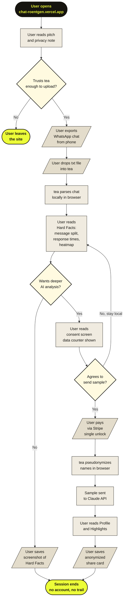

# tea

tea is a web app that analyzes exported WhatsApp conversations. The quantitative layer runs entirely in your browser — no data leaves your device. If you want a deeper read, you decide when that happens and exactly what gets sent.

The app shows patterns in your own communication. Not advice, not scores — just what is actually there in the data.

**Live:** https://chat-roentgen.vercel.app

---

## Installation

tea runs in the browser, so no installation is needed to use it. Open the link above and upload a WhatsApp export.

To run it locally for development:

1. Clone the repository: `git clone https://github.com/Nils43/chat-roentgen.git`
2. Move into the app directory: `cd chat-roentgen/roentgen`
3. Install dependencies: `npm install`
4. Create your environment file: `cp .env.example .env.local` and add your Anthropic API key
5. Start the dev server: `npm run dev` and open `http://localhost:3000`

For the full setup guide, see [`CONTRIBUTING.md`](./CONTRIBUTING.md).

---

## Examples

Upload a WhatsApp `.txt` export and the app parses it locally. The Hard Facts module loads immediately — message split between participants, response times, who initiates conversations, emoji usage, and an activity heatmap by hour and day of week. None of this requires a server call.

If you unlock the AI modules, you get a profile of your own communication style, an analysis of the dynamic between both people, and a breakdown of the most significant moments in the chat. Moments are described as patterns, not quoted directly.

---

## Troubleshooting

**The file won't upload.**
The app currently supports WhatsApp `.txt` exports only. Make sure you chose "Without Media" when exporting and that the file extension is `.txt`. Files exported with media or renamed to a different extension will not be recognized.

**The parsing result looks incomplete or incorrect.**
WhatsApp export formats vary between iOS and Android and across different language settings. German-format exports use `DD.MM.YY, HH:MM:SS` timestamps, English-format exports use `MM/DD/YY, HH:MM AM/PM`. Both are supported, but edge cases exist. If your chat is not parsing correctly, open an issue on GitHub and attach a sanitized version of the file with names and personal details removed.

**Messages from one person are being attributed to the other.**
This can happen if a participant changed their display name at some point during the chat. WhatsApp records the name at the time of export, but older messages may carry a different name. This is a known limitation of the WhatsApp export format.

**The AI modules are not loading.**
If you are running locally, confirm that `ANTHROPIC_API_KEY` is set in your `.env.local` file and that you restarted the dev server after making changes. If you are on the live app and the modules stay loading for more than a minute, try refreshing the page and unlocking again — the session is not stored, but your payment carries over.

**The app is slow on large chats.**
Chats with more than 20,000 messages may take a few seconds to parse. This runs on your device, so performance depends on your hardware. The AI modules also take longer because more content needs to be sampled and sent.

---

## Changelog

**V1 — current**
- WhatsApp `.txt` parser for German and English export formats
- Hard Facts module: message split, response times, question ratio, conversation initiation, hedge word frequency, emoji density, activity heatmap, engagement curve over time — runs entirely in the browser, no server contact
- Profile module: AI-generated analysis of the user's own communication style, based on patterns in their messages only
- Highlights module: AI-generated description of the most significant moments in the chat, described as behavioral patterns without quoting original messages directly
- Consent screen before any AI call, showing the exact number of messages being sent and how they are handled
- Pseudonymization of names before any data leaves the browser
- Privacy indicator showing local vs. AI-active state throughout the session
- Stripe payment integration for single chat unlock

**V2 — planned**
Telegram and Instagram parser support, Dynamics module, Development module, Timeline visualization, share-as-image export with automatic anonymization, subscription model.

**V3 — planned**
Multi-chat comparison, Discord and iMessage support, localization.

---

## User Flow

This diagram shows the path a typical first-time user takes through tea, from landing on the site to saving their first insight.

---

## Additional resources

- [`Concept.md`](./Concept.md) — architecture and design rationale
- [`CONTRIBUTING.md`](./CONTRIBUTING.md) — contribution guidelines
- [`tea_konzept.md`](../tea_konzept.md) — product concept document (German)

---

## License

MIT. Free to use, copy, modify, and distribute this code, as long as the original copyright notice is included.

---

## Maintained by

Antonia and Nils Heck — CODE University of Applied Sciences, Berlin

