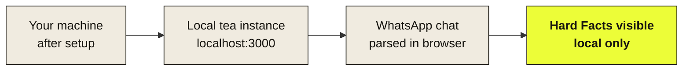

# Getting Started

This guide takes you from zero to a running tea instance with a parsed test chat in about 10 minutes. By the end, you will have:

- tea running on your local machine
- A WhatsApp chat parsed locally in your browser
- The Hard Facts module showing real numbers from that chat

> **Note:** This guide is for developers who want to run tea locally. If you only want to use tea, the [live version](https://chat-roentgen.vercel.app) is the faster path. Come back here when you want to develop or contribute.

## What you will build



## Prerequisites

Before starting, make sure you have:

| Tool | Minimum version | Check with |
|---|---|---|
| Node.js | 18.0 | `node --version` |
| npm | 9.0 | `npm --version` |
| Git | any recent | `git --version` |
| An Anthropic API key | — | [console.anthropic.com](https://console.anthropic.com) |

If anything is missing:

- **Node.js + npm:** install the LTS version from [nodejs.org](https://nodejs.org)
- **Git:** install from [git-scm.com](https://git-scm.com), or on macOS run `xcode-select --install`
- **Anthropic API key:** sign up at [console.anthropic.com](https://console.anthropic.com), create a key. New accounts get free credits to start.

> **Note:** If you only want to develop the local Hard Facts layer (no AI modules), you can skip the Anthropic API key. The app will still work — only the paywall flow stays inactive.

## 1. Clone the repository

Open your terminal, navigate to where you want the project, then run:

```bash
git clone https://github.com/Nils43/chat-roentgen.git
cd chat-roentgen/roentgen
```

The application code lives in the `roentgen/` subfolder. The repository root contains conceptual and strategy documents (Concept, Privacy Audit, DPIA, etc.).

> **Verify:** Run `ls`. You should see files like `package.json`, `src/`, and `index.html`.

## 2. Install dependencies

Inside the `roentgen/` folder:

```bash
npm install
```

This installs all packages from `package.json`. The first install can take a minute or two.

> **Verify:** A `node_modules/` folder appeared. No error messages in the terminal.

## 3. Configure your environment

Copy the environment template and fill in your Anthropic API key:

```bash
cp .env.example .env.local
```

Open `.env.local` in your editor. Replace `your-key-here` with your actual key from [console.anthropic.com](https://console.anthropic.com):

```
ANTHROPIC_API_KEY=sk-ant-api03-xxxxxxxxxxxx
```

> **Caution:** Never commit `.env.local` to the repository. The `.gitignore` already excludes it, but always double-check before pushing.

## 4. Start the development server

```bash
npm run dev
```

You should see something like:

```
ready - started server on http://localhost:3000
```

Open `http://localhost:3000` in your browser. You should see tea's landing page with the upload area.

> **Verify:** The page loads, the `· local only` indicator is visible, and the upload area responds to hover.

## 5. Your first Hello World — parse a chat

Now the satisfying part. Let's make tea actually work end-to-end.

### Export a test chat from WhatsApp

On your phone:

1. Open any WhatsApp chat (pick a low-stakes one for testing)
2. Tap the contact name → scroll down → **Export Chat** → **Without Media**
3. Email the resulting `.txt` file to yourself, or save to a cloud drive

> **Note:** tea currently parses WhatsApp `.txt` exports in German (`[DD.MM.YY, HH:MM:SS]`) and English (`MM/DD/YY, HH:MM AM/PM`) formats. Other formats (Telegram, Instagram) are on the roadmap but not yet supported.

### Upload it to your local tea

1. On `http://localhost:3000`, drop the `.txt` file onto the upload area
2. Wait for the parsing animation
3. Read the Hard Facts that appear

You should see numbers like message split, response times, and an activity heatmap. Everything you see came from your browser parsing the file — no data was sent anywhere.

> **Verify:** The `· local only` indicator stayed active throughout. Open your browser's DevTools → Network tab → filter for `xhr` or `fetch`. You should see zero requests during parsing. That's the privacy guarantee, made visible.

If you also configured the Anthropic API key, you can test the AI modules by clicking the unlock button. Use Stripe test card `4242 4242 4242 4242` (any future date, any CVC) to bypass the paywall on local instances.

## What you can do next

Now that tea runs locally, here are the most useful next steps:

- **[Tutorial](tutorial.md)** — walk through a complete user session, including the AI modules
- **[Concept](concept.md)** — read the high-level architecture and design decisions *(maintained by Nils)*
- **[Contributing](contributing.md)** — read this before submitting changes *(maintained by Nils)*
- **Try a different chat** — patterns become clearer when you compare multiple conversations

## Troubleshooting

These are the five most common setup issues.

### `npm install` fails with permission errors (`EACCES`)

Your npm permissions are misconfigured. Either:

- Use `sudo npm install` (quick fix, works always)
- Or follow [npm's official guide](https://docs.npmjs.com/resolving-eacces-permissions-errors-when-installing-packages-globally) to set up a user-writable npm prefix (cleaner long-term)

### Port 3000 is already in use

Another process is using the default port. Run on a different port:

```bash
npm run dev -- --port 3001
```

Then open `http://localhost:3001` instead.

### The `.txt` file does not parse

The most common causes:

- The export includes media — re-export with **Without Media**
- The file extension was changed — make sure it's `.txt`, not `.txt.zip` or similar
- The chat is too short (< 50 messages) — try a longer chat
- The chat uses a non-supported format (e.g. Telegram `.json`)

If your WhatsApp `.txt` still does not parse, [open an issue](https://github.com/Nils43/chat-roentgen/issues) with a sanitized version of the file (names removed).

### AI modules return an authentication error

Your `ANTHROPIC_API_KEY` is missing or invalid. Open `.env.local`, verify the key matches your Anthropic console, and **restart the dev server** — environment variable changes do not hot-reload.

### Messages from one person are attributed to the other

This happens when a participant changed their display name during the chat. WhatsApp records the name at export time, but older messages may carry a different one. This is a known limitation of the WhatsApp export format, not a bug in tea.

## Need help?

If you're stuck on something not covered here, [open an issue on GitHub](https://github.com/Nils43/chat-roentgen/issues) with:

- What you were trying to do
- What you ran (exact commands)
- What error you got (full text or screenshot)

The more specific you are, the faster we can help.
