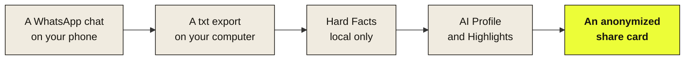

# Tutorial: Your first tea session

Learn how tea works by running a complete session, end to end. Takes about 10 minutes.

You will learn how to:

- Export a WhatsApp chat in the right format
- Read the Hard Facts (the free, local layer)
- Decide whether the AI modules are right for you
- Move through the consent flow safely
- Save an auto-anonymized share card

> **Note:** This tutorial uses your own chat as test data. Pick a low-stakes one for your first run — a chat with a friend, a family group, anything where you would not mind seeing the numbers. Avoid sensitive conversations until you know what tea actually shows.

## What you will build



## Prerequisites

You need:

- A phone with **WhatsApp** installed
- A **chat with at least 50 messages** (shorter chats produce thin analyses)
- A way to **transfer the export** from phone to computer (email, AirDrop, cloud drive)
- A **browser** on your computer

This tutorial assumes you are using the [live version](https://chat-roentgen.vercel.app). If you are running tea locally, all steps still apply — just open `http://localhost:3000` instead of the live URL, and use Stripe test card `4242 4242 4242 4242` in step 7.

## 1. Export your chat from WhatsApp

On your phone:

1. Open the chat you picked
2. Tap the contact name at the top
3. Scroll down and tap **Export Chat**
4. Choose **Without Media**

WhatsApp creates a `.txt` file. Send it to yourself by email, save to a cloud drive, or use AirDrop.

> **Caution:** The export contains every message in the chat. Treat it like sensitive data — don't email it to third parties, and delete it from your downloads after this session.

> **Verify:** You have a file named something like `WhatsApp Chat with [Name].txt` on your computer.

## 2. Open tea

Go to [chat-roentgen.vercel.app](https://chat-roentgen.vercel.app).

You should see the landing page with one line of text and an upload area.

> **Verify:** A small `· local only` indicator is visible at the top. This stays on as long as nothing has been sent to a server.

## 3. Upload the chat

Drag the `.txt` file onto the upload area, or click the area to pick the file manually.

A short reading animation runs (something like *"4,327 messages. 8 months. I'm almost there."*), then the Hard Facts panel appears.

> **Verify:** Real numbers from your chat are now visible. The `· local only` indicator is still on. If you check your browser's DevTools Network tab, you'll see zero requests during parsing — the privacy guarantee, made visible.

## 4. Read the Hard Facts

Scroll through the panel. You should see something like:

```
73% of messages from you · 27% from Tim
You initiate 4 of 5 conversations
Median response time — you: 3 min · Tim: 14 min
Most active window: Sunday, 23:00–01:00
```

Some metrics are hidden behind a "gate" — tea asks you to guess the number before revealing it. You can skip the gate without penalty.

Take a few minutes here. The Hard Facts alone are often enough.

> **Verify:** The numbers feel coherent. If something looks completely off (e.g. one person attributed to everything), see [Getting Started → Troubleshooting](getting-started.md#troubleshooting).

## 5. Decide whether to unlock the AI modules

Below the Hard Facts you'll see two blurred cards: **Profile** and **Highlights**. The text shimmers but stays unreadable.

You have two paths:

| Path | What happens | When to choose |
|---|---|---|
| **Stay local** | Save a screenshot of the Hard Facts and end the session. Free, fully private. | If the Hard Facts answered your question, or you don't want anything sent to an external service. |
| **Unlock AI** | Continue to step 6. A pseudonymized sample of your chat is sent to the Claude API. | If you want a deeper read — your communication style and the most significant moments. |

If you want to stay local, save the screenshot now and skip to step 10. Otherwise, click any blurred card.

## 6. Review the consent screen

A consent screen appears showing:

- **How many messages** will be sent (a sample, not the whole chat)
- **What gets pseudonymized** — names are replaced with "Person A" and "Person B" in your browser before sending
- **Anthropic's data retention** — 30 days, no training, deleted afterwards

Read the whole thing. This is the most important moment in the flow.

> **Caution:** Once you click **Start analysis**, the sample leaves your browser. There is no way to recall it. If unsure, click **Stay local** — you keep the Hard Facts.

If you agree, click **Start analysis**. The indicator at the top changes from `· local only` to `· ai active`.

## 7. Pay for the unlock

The paywall offers:

- **Single Unlock** — €4.99 for all AI modules on this chat
- **Subscription** — €9.99/month for unlimited chats

Pay with whichever option fits. No account is required for the Single Unlock.

> **Note:** On a local instance, use Stripe test card `4242 4242 4242 4242` with any future expiry and any 3-digit CVC.

## 8. Read your Profile

The first AI module appears. The Profile describes your communication style across four axes:

- Direct ↔ Indirect
- Emotional ↔ Factual
- Expansive ↔ Concise
- Initiating ↔ Reactive

Below the axes: your hedge patterns, apology behavior, and linguistic fingerprint (favorite words, sentence starters, punctuation habits).

> **Note:** The Profile only describes you. By design, it never profiles the other person — they did not consent to being analyzed. Patterns *between* the two of you are described in the Highlights, but not as a personality assessment of them.

## 9. Read the Highlights

The Highlights module surfaces the most significant moments in the chat — described as **patterns**, not direct quotes.

Example output:

```
March 14th, 23:47.
Her only message that week with self-doubt.
Three days of silence afterwards.
```

You'll see this kind of pattern-description for moments that stood out — emotional peaks, breaks in routine, ignored messages, unusual timing.

> **Note:** No original chat content is reproduced — only the *shape* of what happened. This is both a privacy choice and a design choice: the Highlights show you the pattern, not the receipt.

## 10. Save and close

Click **Save** on any card you want to keep. tea exports it as an image with names automatically replaced by placeholders (e.g. "Person A").

When you close the browser tab, no session data stays on the server. There is no account, no log, no trail.

> **Verify:** The exported image shows placeholder names, not real ones. If you ever see a real name in an exported card, that is a bug — please [open an issue](https://github.com/Nils43/chat-roentgen/issues).

## What you learned

After this tutorial you can:

- Export a WhatsApp chat in the supported `.txt` format
- Run a local-only analysis without anything leaving your device
- Read the consent screen critically and decide what gets sent
- Trigger and read the AI modules (Profile + Highlights)
- Save shareable cards without exposing real names

You now know the full tea flow.

## Next steps

- **Try a different chat.** A friendship, a family group, a work chat — each shows a different version of you.
- **Read the [Concept](concept.md)** if you want to understand why each module is designed the way it is *(maintained by Nils)*.
- **Run tea locally** with [Getting Started](getting-started.md) if you want to develop or contribute.
- **Found a bug or have feedback?** [Open a GitHub issue](https://github.com/Nils43/chat-roentgen/issues) — the more specific, the more useful.
